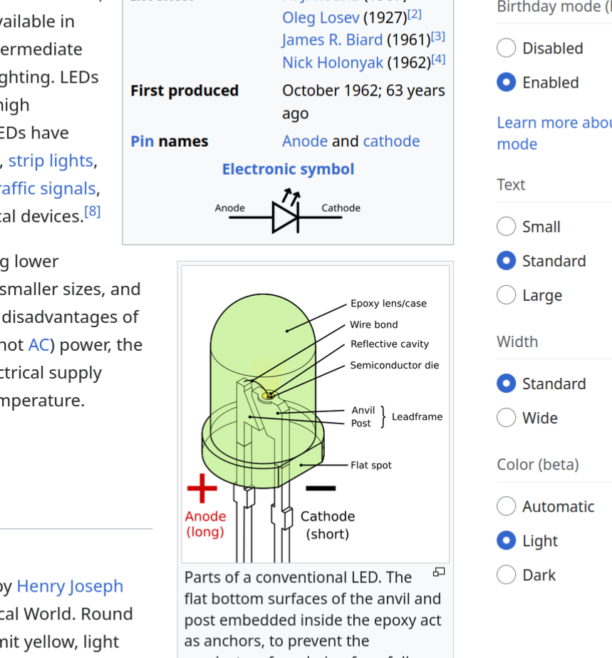
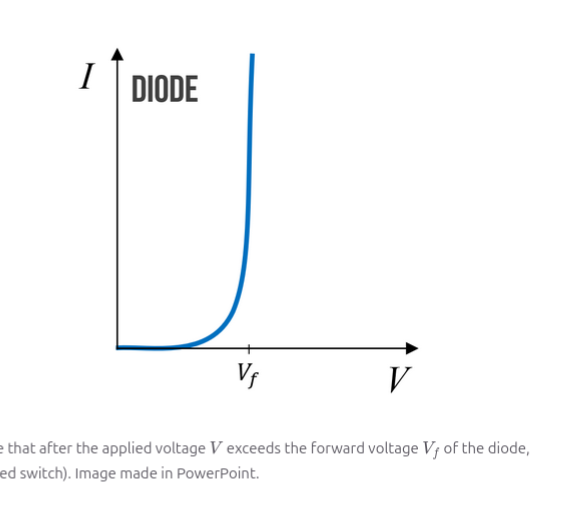

= Making Artistic PCBs with KiCad
:author: Philip Knodle
:doctype: book
:toc:
:ascii-ids:
:experimental:

[[copyright]]
*Copyright*

All trademarks within this guide belong to their legitimate owners.

[[contributors]]
*Contributors*

:sectnums:

In this class we will be going over designing PCBs with KiCad.

We''re not going to go over system design, component selection, or schematic design.   

This is the typing class to a creative writing class

= Class 1
:sectnums:

* Learn what a PCB is and how it''s constructed
* Run KiCad and learn about the tools:
** Schematic Editor
** Layout Editor
** Learn about Gerber files
** Gerber View
* Layout a simple board
** Start with a schematic
** Place components
** 

== Components
A physical device that does something in a circuit

* LED
* Resistor
* Connector

== LED

An LED is a light eminating diode.  It converts current to light

== Resistor
Resistor V = IR

== Connector

== What is a circuit?
A bunch of physical components that are connected so that they do something.

== Mounting holes

== What is a PCB?
Sandwich with a fiberglass core. Layer stackup
* Silk Screen
* Solder mask
* Copper foil
* epoxy
* Fiber glass core
* epoxy
* Copper foil / ENIG
* Solder mask
* Silk screen

== There is a color difference when solder mask is on top of a trace or bare FR4

== How it''s made
Video of etchign / mill

=== Section on photo resist

== Through hole vs Surface Mount
=== Want to know how to solder SMT components

= Kicad
== Schematic Editor
=== Define what a net is
== PCB Editor
=== Set up widths in the actual file

== Gerber Files

== Gerber View

